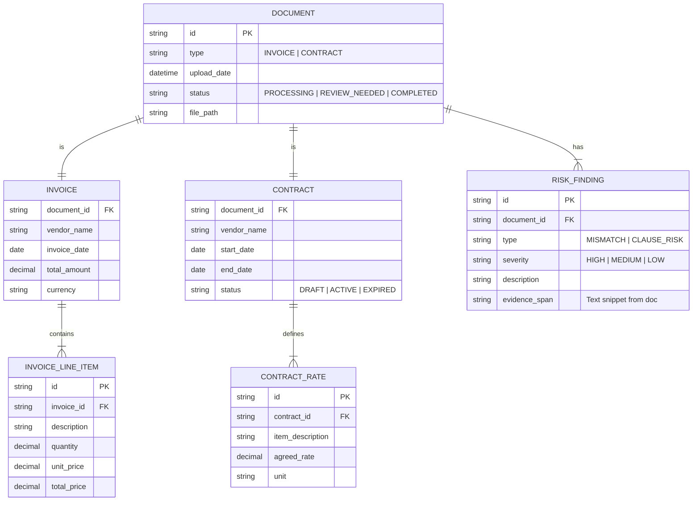

# Data Model

## Conceptual Schema

## Entity Descriptions

### 1. Document
The root entity representing an uploaded file.
- **Fields**: `id`, `uploaded_by`, `s3_path`, `ocr_status`.

### 2. RiskFinding
Represents a discrepancy or risk detected by the AI.
- **Mismatch**: When `InvoiceLineItem.unit_price` > `ContractRate.agreed_rate`.
- **ClauseRisk**: A problematic legal clause (e.g., "Governing Law: Mars").
- **Fields**: `evidence_span` is crucial for the UI to highlight the exact location in the PDF.
